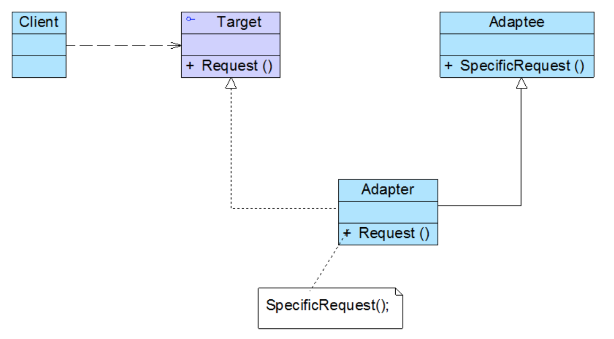

# 适配器模式Adapter（结构型)

## 概述

接口的改变，是一个需要程序员们必须接受和处理的普遍问题。

例子1：iphone4，即可以使用USB接口连接电脑来充电，假如只有iphone没有电脑，怎么办呢？苹果提供了iphone电源适配器。可以使用这个电源适配器充电。这个iphone的电源适配器就是类似我们说的适配器模式。(电源适配器就是把电源变成需要的电压，也就是适配器的作用是使得一个东西适合另外一个东西。)

例子2：最典型的例子就是很多功能手机，每一种机型都自带有充电器，有一天自带充电器坏了，而且市场没有这类型充电器可买了。怎么办？万能充电器就可以解决。这个万能充电器就是适配器。

## 问题

如何避免因外部库的API改变而带来的不便？
假如写了一个库，能否提供一种方法允许软件的现有用户进行完美地升级，即使已经改变了的api？为了更好地适宜于的需要，应该如何改变一个对象的接口？

## 解决方案

适配器(Adapter)模式为对象提供了一种完全不同的接口。可以运用适配器(Adapter)来实现一个不同的类的常见接口，同时避免了因升级和拆解客户代码所引起的纠纷。

 适配器模式（AdapterPattern），把一个类的接口变换成客户端所期待的另一种接口，Adapter模式使原本因接口不匹配(或者不兼容)而无法在一起工作的两个类能够在一起工作。又称为转换器模式、变压器模式、包装（Wrapper）器模式(把已有的一些类包装起来，使之能有满足需要的接口)。

考虑一下当一个第三方库的API改变将会发生什么。过去只能是咬紧牙关修改所有的客户代码，而情况往往还不那么简单。可能正从事一项新的项目，它要用到新版本的库所带来的特性，但已经拥有许多旧的应用程序，并且它们与以前旧版本的库交互运行地很好。将无法证明这些新特性的利用价值，如果这次升级意味着将要涉及到其它应用程序的客户代码。

## 模式的组成

### 目标角色（Target）

目标抽象类定义客户所需的接口，可以是一个抽象类或接口，也可以是具体类

### 客户角色（Client）

与符合Target接口的对象协同。

### 被适配角色（Adaptee)

定义一个已经存在并已经使用的接口，这个接口需要适配。

### 适配器角色（Adapter)

适配器模式的核心。它将对被适配Adaptee角色已有的接口转换为目标角色Target匹配的接口。对Adaptee的接口与Target接口进行适配.

## 适用性

以下情况适用Adapter模式：

- 想使用一个已经存在的类，而它的接口不符合的需求。
- 想创建一个可以复用的类，该类可以与其他不相关的类或不可预见的类(即那些接口可能不一定兼容的类)协同工作。
- 想使用一些已经存在的子类，但是不可能对每一个都进行子类化以匹配它们的接口。对象适配器可以适配它的父类接口。即仅仅引入一个对象，并不需要额外的指针以间接取得adaptee。

## 类的适配器模式(采用继承实现)

Adapter与Adaptee是继承关系

- 用一个具体的Adapter类和Target进行匹配。结果是当我们想要一个匹配一个类以及所有它的子类时，类Adapter将不能胜任工作
- 使得Adapter可以重定义Adaptee的部分行为，因为Adapter是Adaptee的一个子集
- 仅仅引入一个对象，并不需要额外的指针以间接取得adaptee

### 结构



### 实现

```java
/**
 * 目标接口，可为接口或者抽象类
 */
public interface Target {
    void request();
}

/**
 * 需要适配的类
 */
public class Adaptee {
    public void specialRequest(){
        System.out.println("特殊需求");
    }
}

/**
 *  适配器
 */
public class Adapter extends Adaptee implements Target {
    public void request(){
        specialRequest();
    }
}

public class Client {
    public static void main(String[] args){
        Target target = new Adapter();
        target.request();
    }
}
```

### 结果

> 特殊需求

## 对象适配器

对象适配器模式：采用对象组合方式实现(适配器容纳一个它包裹的类的实例，适配器调用被包裹对象的物理实体)

Adapter与Adaptee是委托关系

- 允许一个Adapter与多个Adaptee同时工作。Adapter也可以一次给所有的Adaptee添加功能
- 使用重定义Adaptee的行为比较困难

### 结构


### 实现

```java
/**
 * 需要适配的类
 */
public class Adaptee {
    public void specialRequest(){
        System.out.println("特殊需求");
    }
}

/**
 * 目标接口，可为接口或者抽象类
 */
public class Target {
    public void request(){
        System.out.println("普通需求");
    }
}

/**
 *  适配器
 */
public class Adapter extends Target {
    private Adaptee adaptee = new Adaptee();

    public void request(){
        //把表面上调用Target.request()变成实质上调用adaptee.specialRequest()
        adaptee.specialRequest(); 
    }
}

/**
 * 调用实体
 */
public class Client {
    @Test
    public void test() {
        Target target = new Adapter();
        target.request();
    }
}
```

### 结果

> 特殊需求

## 适配器模式与其它模式

### 桥梁模式(bridge模式) ：

桥梁模式与对象适配器类似，但是桥梁模式的出发点不同：桥梁模式目的是将接口部分和实现部分分离，从而对它们可以较为容易也相对独立的加以改变。而对象适配器模式则意味着改变一个已有对象的接口

### 装饰器模式(decorator模式)：

装饰模式增强了其他对象的功能而同时又不改变它的接口。因此装饰模式对应用的透明性比适配器更好。结果是decorator模式支持递归组合，而纯粹使用适配器是不可能实现这一点的。

### Facade（外观模式)：

适配器模式的重点是改变一个单独类的API。Facade的目的是给由许多对象构成的整个子系统，提供更为简洁的接口。而适配器模式就是封装一个单独类，适配器模式经常用在需要第三方API协同工作的场合，设法把的代码与第三方库隔离开来。

适配器模式与外观模式都是对现相存系统的封装。但这两种模式的意图完全不同，前者使现存系统与正在设计的系统协同工作而后者则为现存系统提供一个更为方便的访问接口。简单地说，适配器模式为事后设计，而外观模式则必须事前设计，因为系统依靠于外观。总之，适配器模式没有引入新的接口，而外观模式则定义了一个全新的接口。

### 代理模式（Proxy）：在不改变它的接口的条件下，为另一个对象定义了一个代理。

装饰者模式，适配器模式，外观模式三者之间的区别：
装饰者模式的话，它并不会改变接口，而是将一个一个的接口进行装饰，也就是添加新的功能。
适配器模式是将一个接口通过适配来间接转换为另一个接口。
外观模式的话，其主要是提供一个整洁的一致的接口给客户端。