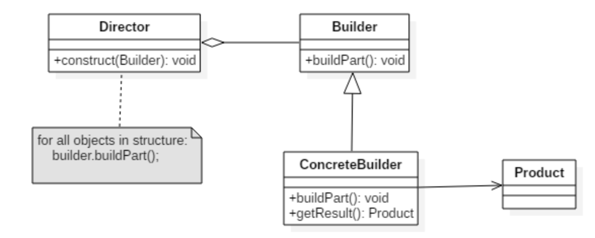

## 引言
在软件开发的过程中，当遇到一个“复杂对象”的创建工作，该对象由一定各个部分的子对象用一定的算法构成，由于需求的变化，复杂对象的各个部分经常面临剧烈的变化，但将它们组合在一起的算法相对稳定。
例子：买肯德基
典型的儿童餐包括一个主食，一个辅食，一杯饮料和一个玩具（例如汉堡、炸鸡、可乐和玩具车）。这些在不同的儿童餐中可以是不同的，但是组合成儿童餐的过程是相同的。
客户端：顾客，想去买一套套餐（这里面包括汉堡，可乐，薯条），可以有 1 号和 2 号两种套餐供顾客选择。
指导者角色：收银员。知道顾客想要买什么样的套餐，并告诉餐馆员工去准备套餐。
建造者角色：餐馆员工。按照收银员的要求去准备具体的套餐，分别放入汉堡，可乐，薯条等。
产品角色：最后的套餐，所有的东西放在同一个盘子里面。
## 定义
建造者模式：将一个复杂对象的构建与它的表示分离，使得同样的构建过程可以创建不同的表示。
## 结构



### 抽象建造者角色（Builder）
为创建一个 Product 对象的各个部件指定抽象接口，以规范产品对象的各个组成成分的建造。一般而言，此角色规定要实现复杂对象的哪些部分的创建，并不涉及具体的对象部件的创建。

### 具体建造者（ConcreteBuilder）
+ 实现 Builder 的接口以构造和装配该产品的各个部件，即实现抽象建造者角色 Builder 的方法。
+ 定义并明确它所创建的表示，即针对不同的商业逻辑，具体化复杂对象的各部分的创建
+ 提供一个检索产品的接口
+ 构造一个使用 Builder 接口的对象即在指导者的调用下创建产品实例

### 指导者（Director）
调用具体建造者角色以创建产品对象的各个部分。指导者并没有涉及具体产品类的信息，真正拥有具体产品的信息是具体建造者对象。它只负责保证对象各部分完整创建或按某种顺序创建。

### 产品角色（Product）
建造中的复杂对象。它要包含那些定义组件的类，包括将这些组件装配成产品的接口。

## 实现

```java
/**
 * 抽象建造者类，确定产品由2个部件partA和partB组成，并声明得到一个产品构建结果的方法
 */
public abstract class Builder {
    public abstract void buildPartA();
    public abstract void buildPartB();
    public abstract Product getResult();
}

/**
 * 具体建造者
 */
public class ConcreteBuilder1 extends Builder {
    private Product product = new Product();
    @Override
    public void buildPartA() {
        product.add("部件A");
    }

    @Override
    public void buildPartB() {
        product.add("部件B");
    }

    @Override
    public Product getResult() {
        return product;
    }
}

/**
 * 具体建造者
 */
public class ConcreteBuilder2 extends Builder {
    private Product product = new Product();
    @Override
    public void buildPartA() {
        product.add("部件X");
    }

    @Override
    public void buildPartB() {
        product.add("部件Y");
    }

    @Override
    public Product getResult() {
        return product;
    }
}

/**
 * 产品类，由多个部件组成
 */
public class Product {
    List<String> parts = new ArrayList<String>();

    public void add(String part){
        parts.add(part);
    }

    public void show(){
        System.out.print("产品创建:");
        for (String part : parts){
            System.out.print(part + ",");
        }
        System.out.println();
    }
}

/**
 * 指挥者类
 */
public class Director {
    public void construct(Builder builder){
        builder.buildPartA();
        builder.buildPartB();
    }
}

public class BuilderTest {
    @Test
    public void test() {
        ConcreteBuilder1 concreteBuilder1 = new ConcreteBuilder1();
        ConcreteBuilder2 concreteBuilder2 = new ConcreteBuilder2();
        Director director = new Director();
        director.construct(concreteBuilder1);
        Product product = concreteBuilder1.getResult();
        product.show();

        director.construct(concreteBuilder2);
        product = concreteBuilder2.getResult();
        product.show();
    }
}

# 结果
产品创建:部件A,部件B,
产品创建:部件X,部件Y,
```

## 总结
Builder 模式功能：
+ 它使你可以改变一个产品的内部表示，Builder 对象提供给导向器一个构造产品的抽象接口，该接口使得生成器可以隐藏这个产品的表示和内部结构，它同时也隐藏了该产品是如何装配的，因为产品是通过抽象接口构造的，你在改变该产品的内部表示时所要做的只是定义一个新的生成器。
+ 它将构造代码和表示代码分开，Builder 模式通过封装一个复杂对象的创建和表示方式提高了对象的模块性。客户不需要知道定义产品内部结构的类的所有信息；这些类是不出现在 Builder 接口中的。每个 ConcreteBuilder 包含了创建和装配一个特定产品的所有代码。这些代码只需要写一次；然后不同的 Director 可以复用它以在相同部件集合的基础上构作不同的 Product。
+ 它使你可对构造过程进行更精细的控制，Builder 模式与一下子就生成产品的创建型模式不同，它是在导向者的控制下一步一步构造产品的，仅当该产品完成时导向者才从生成器中取回它，因此 Builder 接口相比其他创建型模式能更好的反映产品的构造过程。这使你可以更精细的控制构建过程，从而能更精细的控制所得产品的内部结构。
  

### Builder模式的优点
+ 建造者模式的封装性很好，使用建造者模式可以有效的封装变化，在使用建造者模式的场景中，一般产品类和建造者类是比较稳定的，因此，将主要的业务逻辑封装在导演类中对整体而言可以取得比较好的稳定性。
+ 建造者模式很容易进行扩展。如果有新的需求，通过实现一个新的建造者类就可以完成，基本上不用修改之前已经测试通过的代码，因此也就不会对原有功能引入风险。