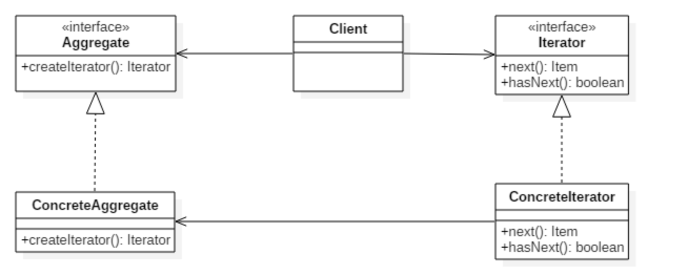

## 概述
如何操纵任意的对象集合？
如一个列表(List)或者一个集合(Set)，又如何提供一种方法来让别人可以访问它的元素，而又不需要暴露它的内部结构？
迭代器模式：使用迭代器模式来提供对聚合对象的统一存取，即提供一个外部的迭代器来对聚合对象进行访问和遍历，而又不需暴露该对象的内部结构。又叫做游标（Cursor）模式。

## 适用性
迭代器模式可用来：
+ 访问一个聚合对象的内容而无需暴露它的内部表示。
+ 需要为聚合对象提供多种遍历方式。
+ 为遍历不同的聚合结构提供一个统一的接口(即,支持多态迭代)

## 结构

结构上可以看出，迭代器模式在客户与容器之间加入了迭代器角色。迭代器角色的加入，就可以很好的避免容器内部细节的暴露，而且也使得设计符号“单一职责原则”。
注意，在迭代器模式中，具体迭代器角色和具体容器角色是耦合在一起的。为了使客户程序从与具体迭代器角色耦合的困境中脱离出来，避免具体迭代器角色的更换给客户程序带来的修改，迭代器模式抽象了具体迭代器角色，使得客户程序更具一般性和重用性。这被称为多态迭代。

## 模式的组成
### 抽象迭代器(Iterator)
迭代器定义访问和遍历元素的接口。

### 具体迭代器(ConcreteIterator)
具体迭代器实现迭代器Iterator接口。对该聚合遍历时跟踪当前位置。

### 抽象聚合类(Aggregate)
聚合定义创建相应迭代器对象的接口。

### 具体聚合类(ConcreteAggregate)
具体聚合实现创建相应迭代器的接口，该操作返回ConcreteIterator的一个适当的实例。

## 迭代器模式的作用
+ 它支持以不同的方式遍历一个聚合对象：复杂的聚合可用多种方式进行遍历，迭代器模式使得改变遍历算法变得很容易：仅需用一个不同的迭代器的实例代替原先的实例即可
+ 迭代器简化了聚合的接口，有了迭代器的遍历接口，聚合本身就不再需要类似的遍历接口了
+ 在同一个聚合上可以有多个遍历，每个迭代器保持它自己的遍历状态，因此可以同时进行多个遍历。
+ 在迭代器模式中，增加新的聚合类和迭代器类都很方便，无须修改原有代码，满足“开闭原则”的要求。
迭代器模式的缺点
由于迭代器模式将存储数据和遍历数据的职责分离，增加新的聚合类需要对应增加新的迭代器类，类的个数成对增加，这在一定程度上增加了系统的复杂性。

## 实现

```java
/**
 * 迭代器接口
 */
public interface Iterator<T> {
    T next();
    boolean hasNext();
}

/**
 * 迭代器实现
 */
public class ConcreteIterator<T> implements Iterator {
    private List<T> list;
    private int index = 0;

    public ConcreteIterator(List<T> list) {
        this.list = list;
    }

    @Override
    public T next() {
        return list.get(index++);
    }

    @Override
    public boolean hasNext() {
        return index < list.size();
    }
}

/**
 * 聚合定义创建相应迭代器对象的接口
 */
public interface Aggregate {
    Iterator createIterator();
}

/**
 * 具体聚合实现创建相应迭代器的接口，该操作返回ConcreteIterator的一个适当的实例
 */
public class ConcreteAggregate<T> implements Aggregate {
    private List<T> list = new ArrayList<>();

    public Iterator createIterator() {
        return new ConcreteIterator(list);
    }

    public void setList(List<T> list) {
        this.list = list;
    }
}

public class IteratorTest {
    @Test
    public void test() {
        ConcreteAggregate concreteAggregate = new ConcreteAggregate();
        List<String> list = new ArrayList<>();
        list.add("A");
        list.add("B");
        list.add("C");
        list.add("D");
        list.add("E");
        list.add("F");
        concreteAggregate.setList(list);

        Iterator iterator = concreteAggregate.createIterator();
        Object object = null;
        while (iterator.hasNext()) {
            object = iterator.next();
            System.out.print(object + "  ");
        }
    }
}

结果
A  B  C  D  E  F  
```

## 迭代器模式与其他相关模式
组合模式(Composite)：迭代器常被应用到象复合这样的递归结构上。
工厂方法模式(FactoryMethod)：多态迭代器靠FactoryMethod来例化适当的迭代器子类。
备忘录模式(Memento)：常与迭代器模式一起使用。迭代器可使用一个Memento来捕获一个迭代的状态。迭代器在其内部存储Memento。

## 总结与分析
+ 聚合是一个管理和组织数据对象的数据结构。
+ 聚合对象主要拥有两个职责：一是存储内部数据；二是遍历内部数据。
+ 存储数据是聚合对象最基本的职责。
+ 将遍历聚合对象中数据的行为提取出来，封装到一个迭代器中，通过专门的迭代器来遍历聚合对象的内部数据，这就是迭代器模式的本质。迭代器模式是“单一职责原则”的完美体现。